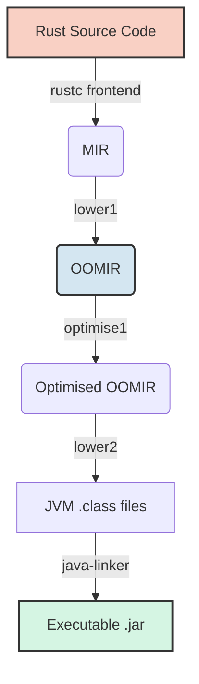

# rustc_codegen_jvm

**A custom Rust compiler backend that compiles Rust directly to Java Virtual Machine (JVM) bytecode.**

[](https://opensource.org/licenses/MIT)
[](https://github.com/IntegralPilot/rustc_codegen_jvm/actions)
[](https://rustup.rs/)

Compile your Rust code into a self-contained, runnable `.jar` compatible with JVM 8+. This backend transparently compiles Rust constructs to Java classes and interfaces, enabling rich interop between JVM and Rust code at a level mostly unreachable by FFI solutions. 

Looking ahead, it is envisioned that with further work this backend could benefit any Rust project, not just those requiring JVM integration. In future, by leveraging this backend and the JVM's robust debugging tools and hot-swapping capabilities, Rust developers could iterate quickly during local development to avoid the compile-time bottlenecks of the native toolchain, before compiling to a native binary for release.

It should be noted that this project is still in early development, but is supporting more of the Rust language as time goes on! The eventual goal is a potential upstreaming with main `rustc`, though that is definently a while away!

**I am so grateful for any stars and support!**

## Why use this?

### Interop is deeper and more ergonomic than FFI or bridge solutions

Rust enums, generics, function pointers, unions and other supported constructs map directly onto JVM classes and interfaces (see [Interop Model](#interop-model)). Because of this, `rustc_codegen_jvm` can achieve a level of ergonomic interop with Java that comparable native solutions can't easily. For example, you can make a Java class that implements a Rust trait and pass it as a `&dyn Trait` object to Rust functions, because traits just become normal Java interfaces, where this would be (to my knowledge) quite hard, with bridge and FFI solutions.

### It's fast for debugging, a known problem with native Rust

Fresh compilation for most small test crates takes **under 1 second**, making the backend practical for rapid experimentation compared to native compilation. Due to the rich hot reload and debugging ecosystem of the JVM, my vision is that this project can in future make rapidly iterating on Rust code (which is a known drawback of Rust) fast and enjoyable. Though there is still lots of work to be done on both making this compiler faster, and making it easy for Rust code to tap into that ecosystem!

### Code runs anywhere a JVM runs

Because the output is standard bytecode rather than a native binary, your Rust code can target environments where native FFI solutions like Panama are difficult or unavailable, including **sandboxed environments like Minecraft mod loaders** and **Android** (if you convert to DEX files).

Future visions for the project include it being able to help you leverage the JVM's safety to debug undefined behaviour, like [Miri](https://github.com/rust-lang/miri/) but faster because of the JVM's JIT.
 

## Table of Contents
1. [Demos](#demos)
2. [Features](#features)
3. [How It Works](#how-it-works)
4. [Interop Model](#interop-model)
5. [Target Platforms](#target-platforms)
6. [Prerequisites](#prerequisites)
7. [Installation & Build](#installation--build)
8. [Usage](#usage)
9. [Running Tests](#running-tests)
10. [Project Structure](#project-structure)
11. [Contributing](#contributing)
12. [License](#license)

## Demos

These examples live in `tests/binary`, are compiled to JVM bytecode, and are verified on every CI run as part of the integration test suite. Most small examples cold-compile and run in **under 1 second** - verify it yourself with `Instrument.py`.

| Example | Demonstrates |
|---|---|
| **[RSA](tests/binary/rsa/src/main.rs)** | Encryption / decryption |
| **[Binary search](tests/binary/binsearch/src/main.rs)** | Classic search algorithm |
| **[Fibonacci](tests/binary/fibonacci/src/main.rs)** | Recursive sequence generation |
| **[Collatz conjecture](tests/binary/collatz/src/main.rs)** | Iterative mathematical verification |
| **[Large prime generator](tests/binary/primes/src/main.rs)** | Numeric computation at scale |
| **[Enums](tests/binary/enums/src/main.rs)** / **[Structs](tests/binary/structs/src/main.rs)** | Nested data structures - tuples, arrays, slices |
| **[Impl blocks](tests/binary/impl/src/main.rs)** / **[Traits](tests/binary/traits/src/main.rs)** | Trait implementations, including dynamic dispatch |
| **[Function pointers](tests/binary/fn_pointers/src/main.rs)** | Function pointers as values, fields, parameters, returns, and generic members |
| **[Unions](tests/binary/unions/src/main.rs)** | `unsafe` union handling, running on the JVM |

## Features

### Compiler optimisations
- **Constant folding & propagation** evaluating constant expressions and known values at compile time.
- **Dead code elimination** stripping unreachable paths for clean & efficient bytecode.
- **Algebraic simplification** reducing expressions using algebraic identities.

### Rust Language Support
- **Control flow:** `if`/`else`, `match`, `for`, `while`, and `loop`.
- **Data structures** including arrays, slices, structs, tuples, and enums (both C-like and Rust-style).
- **Functions & closures:** calls, recursion, function pointers (as values, parameters, return types, and in generics), and closure capture.
- **OOP constructs** such as `impl` blocks for ADTs, including `self`, `&self`, and `&mut self`.
- **Traits** and dynamic dispatch via `&dyn Trait`.
- **Memory management,** currently mutable borrowing, references, and dereferencing, with more complex stuff currently WIP!
- **Unions** support primitive values, references, tuples, structs, fixed-size arrays, and fieldless or data-carrying enums, including recursively nested combinations of these types.
- **Transmute** between everything supported by unions (uses the same inner machinery)
- **Outputs** executable, self-contained `.jar` generation for binary crates.
- **Testing** with integration coverage across debug and release modes for all of the above.

**Current milestone:** full support for the Rust `core` crate.

## How It Works



1. **`rustc` frontend** parses and type-checks your code, lowering it to Mid-level IR (MIR).
2. **lower1** generates a custom "Object-Oriented MIR" (OOMIR) by reshaping MIR into constructs closer to the JVM's object model.
3. **optimise1** applies constant folding, constant propagation, dead code elimination, and algebraic simplification.
4. **lower2** translates OOMIR into `.class` files via `ristretto_classfile`, including stack map frame generation.
5. **java-linker** bundles the `.class` files with a small runtime shim into a self-contained, runnable `.jar` with an appropriate `META-INF/MANIFEST.MF`.

## Interop Model

Rust types map onto the JVM's class model directly, which is what makes interop feel native from both sides:

| Rust construct | JVM representation |
|---|---|
| `struct` | A standard JVM class, with fields and methods generated 1:1 |
| `enum` | An abstract parent class with an abstract `getVariantIdx`, and one concrete subclass per variant |
| `union` | A JVM class over the union's shared memory layout |
| `trait` | A Java interface - any type implementing the trait implements the interface |
| `fn(A, B) -> R` | A generated single-method Java interface for that signature, with adapter classes for Rust function definitions |
| `impl` methods (`self`, `&self`, `&mut self`) | Instance methods on the generated class |
| `&dyn Trait` | The generated Java interface type, usable as a normal Java argument or return type |

For supported constructs, there is no manual marshalling and no bindings layer to maintain, unlike JNI or Project Panama.

The generated classfiles also carry extra metadata so that IDEs like IntelliJ IDEA offer autocomplete, tooltips, and refactoring support for Rust-defined types directly from Java.

## Target Platforms

Because output is standard JVM bytecode rather than a native binary, `rustc_codegen_jvm` targets environments where native compilation isn't practical or allowed:

- **Any JVM 8+**, including older or constrained runtimes without modern FFI features.
- **Android**, by routing the `.class` output through an external DEX conversion pipeline.
- **Sandboxed or embedded JVM environments**, such as Minecraft mod loaders, where loading native libraries is restricted or undesirable.

## Prerequisites

- **Rust Nightly** - `rustup default nightly`
- **JDK 8+** - `java`, `javac`, and `jar` must be on `PATH`
- **Python 3** - `python` must resolve to Python 3 (`python3` can be substituted on local Linux systems that do not provide the `python` alias)
- **Windows only:** enable [Developer Mode](https://learn.microsoft.com/windows/apps/get-started/enable-your-device-for-development) or run Git from an elevated terminal so it can create symbolic links

## Installation & Build

Clone the repository and build all components with the provided build script.

On Linux or macOS:

```bash
git clone https://github.com/IntegralPilot/rustc_codegen_jvm.git
cd rustc_codegen_jvm
./build.py all
```

On Windows, enable symlinks during the initial checkout:

```powershell
git clone -c core.symlinks=true https://github.com/IntegralPilot/rustc_codegen_jvm.git
cd rustc_codegen_jvm
python build.py all
```

This builds the following, in dependency order:

- The Java library shim (`library/`)
- The `java-linker` executable
- The `rustc_codegen_jvm` backend library
- Configuration files (`config.toml`, `jvm-unknown-unknown.json`)

`build.py` checks file timestamps on subsequent runs, so only modified components are rebuilt.

## Usage

1. **Configure your project**
   In your target Rust project, create or update `.cargo/config.toml` using the template provided in the root of this repository. Your `Cargo.toml` must also enable per-profile compilation flags:

   ```toml
   cargo-features = ["profile-rustflags"]
   ```

2. **Build with Cargo**

   ```bash
   cargo build           # Debug build
   cargo build --release # Optimised build
   ```

3. **Run the generated JAR**

   ```bash
   java -jar target/debug/deps/your_crate*.jar   # Debug build
   java -jar target/release/deps/your_crate*.jar # Release build
   ```

## Running Tests

Ensure the toolchain is built first:

```bash
# On Linux/macOS:
./build.py all
# On Windows:
python build.py all
```

Then run the test suite:

```bash
python Tester.py             # Debug mode
python Tester.py --release   # Release mode
```

Results are printed to the console, and temporary test artifacts are written to `.generated/` for inspection. The runner defaults to your local CPU core count; override it with `-j` / `--jobs`.

## Project structure

```
.
├── src/                      # rustc_codegen_jvm compiler backend
│   ├── lib.rs
│   ├── lower1/               # MIR -> OOMIR conversion
│   ├── optimise1/            # OOMIR optimiser
│   ├── lower2/               # OOMIR -> JVM bytecode translation
│   └── oomir.rs              # OOMIR data definitions
├── java-linker/              # Bundles compiled .class files into .jar archives
├── tests/binary/             # Integration tests and example source crates
├── library/                  # Java shim implementation for the Rust core library
├── build.py                  # Orchestrator build script
├── config.toml.template      # Cargo configuration template
├── jvm-unknown-unknown.json.template
├── Tester.py                 # Automated test runner
└── LICENSE, LICENSE-Apache
```

## Contributing

Issues and pull requests are welcome and would be greatly appreciated!

If you'd like to get involved but aren't sure where to start, open a thread on the [Discussions](https://github.com/IntegralPilot/rustc_codegen_jvm/discussions) page - I am happy to help scope out a task list. For larger changes, opening an issue first to discuss the approach is appreciated.

## License

This project is dual-licensed under your choice of:

- **MIT License** - <https://opensource.org/licenses/MIT>
- **Apache License, Version 2.0** - <https://www.apache.org/licenses/LICENSE-2.0>
