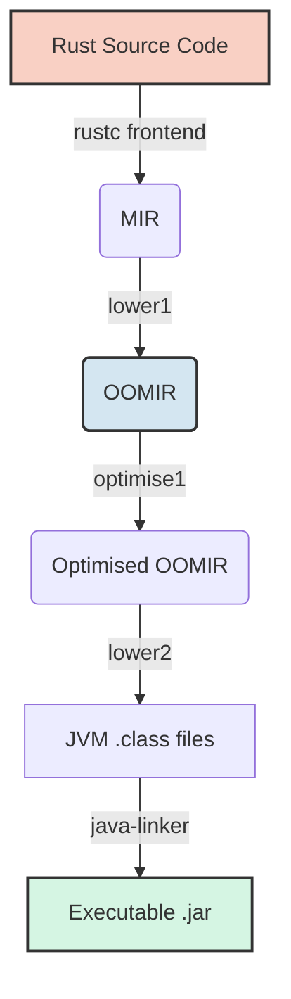

# rustc_codegen_jvm

[](https://opensource.org/licenses/MIT)
[](https://github.com/IntegralPilot/rustc_codegen_jvm/actions)
[](https://rustup.rs/)


A custom Rust compiler backend that compiles Rust directly to Java Virtual Machine (JVM) bytecode, enabling you to compile crates into a runnable `.jar` compatible with Java 8+. 


This backend transparently compiles Rust constructs to Java classes and interfaces, enabling rich interop between JVM and Rust code at a level mostly unreachable by traditional FFI solutions. It also enables modern Rust code to run on older platforms outside the reach of current native targets, and has integrated upstream changes into OpenJDK's C2 JIT compiler which can make the JVM faster for everyone, including [~1.85x faster 128-bit multiplication on x86](https://github.com/openjdk/jdk/pull/30174).

By leveraging a ["virtual MMU" translation layer](runtime/src/Pointer.java), it supports [raw pointers with complex pointer arithmetic](tests/binary/raw_ptrs/src/main.rs), [transmute](tests/binary/transmute/src/main.rs), and [unions](tests/binary/raw_ptrs/src/main.rs). It also supports key parts of the Rust standard library, including [threading](tests/binary/threads/src/main.rs), [unwinding](tests/binary/panic/src/main.rs), [allocation](tests/binary/alloc/src/main.rs), [STDIO, and more](tests/binary/std/src/main.rs).

The official Rust [`coretests`](https://github.com/rust-lang/rust/tree/main/library/coretests) tests and benches all pass, with 98.99% of them (the missing 1.01% is 29 slow cases which are skipped on CI) verified [by CI](.github/workflows/ci.yml) on every commit.

> [!NOTE]
> This project is in an active mid-stage of development. While it supports the vast majority of the Rust language, edge-case bugs are continually being ironed out. The ultimate goal is potential upstreaming into main `rustc`.

**Stars, contributions, and feedback are highly welcome and appreciated!**

## Quickstart

Get up and running quickly:

```bash
# 1. Clone the repository
git clone https://github.com/IntegralPilot/rustc_codegen_jvm
cd rustc_codegen_jvm

# 2. Build the backend toolchain
./build.py all   # On Windows: python build.py all

# 3. Make a new hello_world project
cargo new hello_world --bin
cd hello_world

# 4. Build it using cargo (the script automatically provides the right args)
../jvm_build.py # On Windows: python jvm_build.py

# 5. Run the resulting JAR
# Replace : (inside `classes:target`) with ; if on Windows
java -cp ../runtime/build/classes:target/jvm-unknown-unknown/debug/hello_world.jar hello_world.hello_world

# You should see "Hello, world!" printed to the console.
```

Then, head down to [Usage](#usage) to learn how to integrate it into your project.

## Table of Contents
1. [Why is this useful?](#why-is-this-useful)
2. [Demos](#demos)
3. [Features & Standard Library Support](#features--standard-library-support)
4. [Current Limitations](#current-limitations)
5. [How It Works](#how-it-works)
6. [Interop Model](#interop-model)
7. [Prerequisites](#prerequisites)
8. [Installation & Build](#installation--build)
9. [Usage](#usage)
10. [Running Tests](#running-tests)
11. [Project Structure](#project-structure)
12. [Contributing](#contributing)
13. [License](#license)

## Why is this useful?

### Interop is deeper and more ergonomic than FFI or bridge solutions

Rust enums, generics, function pointers, unions, and traits map directly onto JVM classes and interfaces (see [Interop Model](#interop-model)). Because of this, `rustc_codegen_jvm` achieves a level of ergonomic interop with Java that native FFI solutions cannot easily match. For example, you can implement a Rust trait directly on a Java class and pass it as `&dyn Trait` to Rust ([test and demo](tests/integration/trait_implementors/Main.java)), or pass a standard Java lambda directly to a Rust function expecting a `Fn` closure ([test and demo](tests/integration/lambda_callbacks/Main.java)).

**Java**
```java
import org.rustlang.runtime.Utf8View;
import my_crate.NamedCounter;
import my_crate.Accumulator;
import static my_crate.my_crate.*;

public class Main {
    // Implement a Rust trait directly on any Java class
    private static class JavaAccumulator implements Accumulator {
        private int sum = 0;

        @Override
        public int add(int amount) {
            this.sum += amount;
            return this.sum;
        }
    }

    public static void helloWorld() {
        System.out.println("Hello from Rust!");
    }

    public static void main(String[] args) {
        // 1. Interact with Rust types and methods
        NamedCounter counter = NamedCounter.new(Utf8View.fromJavaString("JVM-Counter"));
        counter.increment();
        System.out.println("Counter: " + counter.count);

        // 2. Pass a standard Java lambda directly to a Rust Fn closure
        int result = apply_twice(val -> val * 3, 2);
        System.out.println("Lambda output: " + result);

        // 3. Pass a Java trait implementation to Rust dynamic dispatch
        JavaAccumulator acc = new JavaAccumulator();
        int finalSum = run_accumulation(acc);
        System.out.println("Accumulator sum: " + finalSum);

        // 4. Trigger a foreign function call from Rust back into Java
        trigger_hello();
    }
}
```

**Rust**
```rust
unsafe extern "C" {
    // Link directly to the static method on the Java Main class
    #[link_name = "jvm:static:Main:helloWorld:()V"]
    fn hello_world();
}

pub struct NamedCounter {
    pub name: &'static str,
    pub count: u32,
}

impl NamedCounter {
    pub fn new(name: &'static str) -> Self {
        NamedCounter { name, count: 0 }
    }
    pub fn increment(&mut self) {
        self.count += 1;
    }
}

pub fn apply_twice(callback: &dyn Fn(i32) -> i32, value: i32) -> i32 {
    callback(callback(value))
}

pub trait Accumulator {
    fn add(&mut self, value: i32) -> i32;
}

pub fn run_accumulation(acc: &mut dyn Accumulator) -> i32 {
    acc.add(10) + acc.add(5)
}

pub fn trigger_hello() {
    unsafe { hello_world(); }
}
```

### Runs everywhere a JVM does, even on legacy systems

Because the compiler targets standard JVM bytecode rather than native machine code, compiled output can run on platforms far outside the reach of modern native Rust targets. It supports any environment with **JVM 8+** compatibility.

| Operating System | Native Rust Minimum | JVM 8 (`rustc_codegen_jvm`) |
| :--- | :--- | :--- |
| **Windows** | Windows 10 | Windows Vista SP2 / 7 SP1 |
| **macOS** | 10.12 Sierra | 10.8.3 Mountain Lion |
| **Linux** | Kernel 3.2, glibc 2.17 | Kernel 2.6.28, glibc 2.9+ |
| **Solaris** | Solaris 11.4 | Solaris 10 |

Compiling directly to JVM bytecode also avoids the deployment friction of native shared libraries in restricted environments. This makes compiled JARs highly portable across **sandboxed environments** (such as Minecraft mod loaders) and **Android** platforms (via DEX conversion).

### Benefits the wider JVM ecosystem through JIT compiler improvements
Developing this backend helps inspire me to find opportunities to optimise OpenJDK's upstream HotSpot C2 compiler. Contributions benefit the entire JVM ecosystem (including Java and Kotlin). 

One merged optimisation ([OpenJDK PR #30174](https://github.com/openjdk/jdk/pull/30174)) sped up 128-bit multiplication by **~1.85x** on x86 targets. Another contribution under review ([OpenJDK PR #30485](https://github.com/openjdk/jdk/pull/30485)) introduces internal range-check elimination in loops for common compiled patterns.

### Facilitates gradual migration of JVM codebases to Rust

Transitioning a large production JVM codebase to native Rust is rarely feasible in a single step. `rustc_codegen_jvm` enables an incremental migration path where new or refactored components are written in Rust while remaining fully compatible with the existing JVM application. Once a rewrite is complete, the Rust code can either be target-switched to native or kept on the JVM target for fast iteration and cross-platform consistency.

### Rapid debugging and hot reloading iteration

Once shared standard-library artifacts are cached, incremental compilation for crates is fast. Leveraging the JVM's mature debugging, hot-reloading, and tracing ecosystem (such as JFR and IDE debuggers) opens up rapid iteration workflows that are traditionally difficult with native Rust targets.

Additionally, the virtual MMU layer can catch raw pointer Undefined Behavior (UB) early, throwing structured Java exceptions with accurate stack traces and `LineNumberTable` information.

## Demos

The following example programs live in `tests/`, are compiled with the standard library to JVM bytecode, and are verified in CI on every commit:

### Standard Library Demonstrations
| Example | Demonstrates | 
|---|---|
| **[Alloc](tests/binary/alloc/src/main.rs)** | Complex allocations: binary trees, heaps, linked lists, vectors, strings, Arc/atomics, and drop/cleanup semantics. |
| **[Threads](tests/binary/threads/src/main.rs)** | Multi-threading, scoped threads, mutexes (with poisoning), RWLocks, barriers, condition variables, and TLS. | 
| **[Panic](tests/binary/panic/src/main.rs)** | Unwinding, catching static/dynamic panic payloads, resuming unwinds, and custom panic hooks. |
| **[Async / Await](tests/binary/async_await/src/main.rs)** | Multi-poll futures, nested and recursive async work, async closures and trait methods, `dyn Future`, cross-thread execution, cancellation, and unwinding across suspension points. |
| **[STD](tests/binary/std/src/main.rs)** | Command-line arguments, environment variables, standard I/O, and runtime context. |

### Standalone Rust Programs
| Example | Demonstrates |
|---|---|
| **[Raw Pointers](tests/binary/raw_ptrs/src/main.rs)** | Pointer identity, dereferencing, casts, offset arithmetic, fat pointers, and DST handling. |
| **[Unions](tests/binary/unions/src/main.rs)** | `unsafe` union storage, field nesting, and reinterpretation. |
| **[Enums](tests/binary/enums/src/main.rs)** & **[Structs](tests/binary/structs/src/main.rs)** | Complex nested data structures, tuples, arrays, and slices. |
| **[Traits](tests/binary/traits/src/main.rs)** | Trait implementations, trait objects, and dynamic dispatch. |
| **[Function Pointers](tests/binary/fn_pointers/src/main.rs)** | Function pointers as values, struct fields, parameters, returns, and generics. |
| **[Iterators](tests/binary/iterators/src/main.rs)** | Combinators (`map`, `zip`, `chain`, `flatten`), double-ended traversal, and custom iterators. |

### Java & Rust Interop
| Example | Demonstrates |
|---|---|
| **[Lambda Callbacks](tests/integration/lambda_callbacks/Main.java)** | Passing native Java lambdas directly into Rust functions expecting `Fn` closures. |
| **[Trait Implementors](tests/integration/trait_implementors/Main.java)** | Implementing a Rust trait on a Java class and passing it to Rust dynamic dispatch (`&dyn Trait`). |

## Features & Standard Library Support

The vast majority of the Rust language is supported, including generics, traits, coroutines, closures, control flow, data structures, and `unsafe` features (raw pointer arithmetic, transmutes, and unions).

### Standard Library Support Matrix

| Subsystem | Status | Details |
| :--- | :---: | :--- |
| **Core** | **98.99%** | Passed via official upstream `coretests` suite in CI |
| **Alloc** | **Supported** | Complex allocations, includes binary trees, heaps, linked lists, etc. |
| **Threads & Sync** | **Supported** | Thread spawning, scoped threads, Mutex, RwLock, Condvar, TLS |
| **Async & Futures** | **Supported** | Async functions, blocks, closures and trait methods; boxed/recursive `dyn Future`; cancellation |
| **Panic Unwinding** | **Supported** | Complete unwinding stack, `catch_unwind`, panic hooks, and abort-on-double-panic semantics |
| **Stdio & Env** | **Supported** | `println!`, `eprintln!`, `stdin`, `env::args`, `env::vars` |
| **Time & Random** | **Supported** | `SystemTime`, `Instant`, standard entropy seeds |
| **File System (`std::fs`)** | _Planned_ | PAL delegation in progress |
| **Networking (`std::net`)** | _Planned_ | Socket integration planned for future release |

Compiled JAR files emit rich JVM metadata (`LineNumberTable`, parameter names, nested class info), ensuring seamless IDE integration (autocomplete, tooltips, refactoring) in IntelliJ IDEA and detailed stack traces during debugging or profiling with JFR.

## Current Limitations

* `std::fs` is currently non-functional due to pending PAL bindings.
* Code that heavily relies on raw pointer arithmetic executes through the Virtual MMU translation layer, which introduces extra memory allocations and GC overhead compared to structured stack/heap access.
* The backend relies heavily on HotSpot's JIT (C2) compiler for runtime optimisation rather than aggressive AOT passes during compilation.
* The default stack size on the JVM is lower than typical native targets. Like on native, if you encounter a `StackOverflowError` with deeply recursive code, you should increase the per-thread stack size. This can be done with the `-Xss` flag (for example, `java -Xss16m ...`).
* Although upstream `coretests` pass, niche compiler edge cases may still trigger Internal Compiler Errors (ICEs).
* The `quote!()` proc macro is currently unsupported.
* If you pass a Rust object to Java (or another JVM language) code, there's no guarantee it has to follow Rust's rules (i.e. ownership, borrowing, or drop semantics). This matches what happens on native targets when interacting with FFI, but potentially can be improved for the JVM in future.
* Backtraces on panic currently work by raising a JVM exception on Rust panic (as part of the unwind process, because unwinding uses try-except-finally), and the trackback comes from the JVM, not Rust's `std::traceback` which is currently unimplemented and emits some warnings during `std` compile.

## How It Works

### Compilation Pipeline



1. **`rustc` Frontend:** Parses and type-checks code, lowering it to Mid-level IR (MIR).
2. **`lower1`:** Transforms MIR into a custom "Object-Oriented MIR" (OOMIR) matching JVM constructs.
3. **`optimise1`:** Applies constant folding, constant propagation, dead code elimination, and algebraic simplification.
4. **`lower2`:** Translates OOMIR to bytecode, computes stack map frames, and serialises `.class` files via `ristretto_classfile`.
5. **`java-linker`:** Bundles generated `.class` files and the runtime environment into a self-contained `.jar` with manifest metadata.

### Virtual MMU Layer
To enable `unsafe` Rust features without violating JVM bytecode verification or breaking garbage collection, the runtime uses a custom translation layer (`Pointer.java`). The basics are: 
* Safe Rust structures remain standard JVM objects. If memory is accessed via byte-offset raw pointers, the runtime lazily encodes the object into a little-endian byte array, modifies it, and decodes it back.
* Exposing numeric pointer addresses triggers allocation in a synthetic 64-bit address space tracked by a thread-safe navigable map (`ALLOCATION_RANGES`).
* Synthetic allocations use `WeakReference` entries and `ReferenceQueue` hooks to prevent tracking metadata memory leaks.
* Unaligned or arbitrary byte-offset atomic ops map to striped locks (`ATOMIC_STRIPES`), maintaining thread safety up to `SeqCst`.

### Drop / RAII

Because the JVM uses garbage collection, `rustc_codegen_jvm` preserves Rust's deterministic RAII semantics by emitting explicit drop calls at compile time.

* Drop elaboration (scopes, drop order, drop flags) is fully handled by `rustc`'s frontend. The backend emits direct bytecode calls at every MIR `Drop` terminator, executing cleanup synchronously at scope exit rather than relying on GC finalisation.
* This emits static calls for structs, unrolled loops for arrays, dynamic helpers (`Pointer.dropSlice`) for slices, and per-variant virtual methods (`_rust_drop_fields`) for enums to prevent dropping inactive variant payloads.
* Types needing drop implement a simple runtime interface (`public interface RustDrop { void rustDrop(); }`). Dynamic cases like `dyn Trait` objects or pointers use runtime `instanceof` checks (`Pointer.dropRustValue`) to dispatch destructors safely.
* JVM GC handles raw memory reclamation, but all Rust `Drop` side effects (closing handles, releasing locks) run eagerly as normal Java method calls at standard Rust scope boundaries.


## Interop Model

Rust constructs map directly to JVM structures without requiring JNI wrapper code:

| Rust Construct | JVM Representation |
|---|---|
| `struct` | Standard Java class with 1:1 mapped fields and methods |
| `enum` | Abstract base class with concrete subclasses per variant |
| `union` | Class backed by contiguous byte-array storage with reinterpretation helpers |
| `trait` | Java interface |
| `fn(A, B) -> R` | Single-method Java interface (Functional Interface) |
| `impl` methods | Class instance methods |
| `&dyn Trait` | Java interface reference |
| `*const T` / `*mut T` | Shared pointer wrapper (`org.rustlang.runtime.Pointer`) |

## Prerequisites

- **Rust Nightly** (configured automatically via `rust-toolchain.toml`)
- **JDK 8+** (`java`, `javac`, and `jar` must be available on `PATH`)
- **Python 3.8+**

## Installation & Build

Clone the repository and build all toolchain components using the orchestration script:

**Linux / macOS:**
```bash
git clone https://github.com/IntegralPilot/rustc_codegen_jvm
cd rustc_codegen_jvm
./build.py all
```

**Windows:**
```powershell
git clone https://github.com/IntegralPilot/rustc_codegen_jvm.git
cd rustc_codegen_jvm
python build.py all
```

Subsequent runs of `build.py` check file timestamps and only rebuild modified components.

## Usage

1. Copy the generated `config.toml` from the root of this repository into your target Rust project's `.cargo/config.toml`.
2. Compile your crate targeting the JVM:

```bash
/path/to/rustc_codegen_jvm/jvm_build.py   # On Windows: python \path\to\rustc_codegen_jvm\jvm_build.py
```

Add `--release` for optimised artifacts. Output `.jar` files are placed in `target/jvm-unknown-unknown/debug` or `release`. 

If your crate is a binary, it can be executed directly: 
```bash
java -cp /path/to/rustc_codegen_jvm/runtime/build/classes:<app>.jar [crate_name].[crate_name]
```

For workloads with intentionally deep recursion, pass a suitable per-thread JVM stack size:

```bash
java -Xss16m -cp /path/to/rustc_codegen_jvm/runtime/build/classes:<app>.jar [crate_name].[crate_name]
```

If your crate is a library, it will be located in a `deps/` subfolder within the `debug`/`release` folder, and named `[cratename]-[hash].jar`.

## Running Tests

Run the integration and binary test suite:

```bash
python3 Tester.py             # Debug build testing
python3 Tester.py --release   # Release build testing
```

Run the upstream `coretests` verification suite (add `--include-default-ignored` to run really slow cases too):

```bash
python3 Coretests.py             # Debug mode
python3 Coretests.py --release   # Release mode
```

## Project Structure

```
.
├── src/                      # Compiler backend implementation
│   ├── lower1/               # MIR -> OOMIR lowering
│   ├── optimise1/            # OOMIR optimisation passes
│   ├── lower2/               # OOMIR -> Bytecode generator
│   └── oomir.rs              # OOMIR definitions
├── java-linker/              # JAR packaging and manifest utility
├── runtime/                  # Core Java runtime support library
├── std/                      # Standard library JVM patch overlays
├── tests/                    # Integration, binary, and multicrate tests
├── build.py                  # Master build script
├── test_harness.py           # Shared test execution utilities
├── Tester.py                 # Main test suite runner
└── Coretests.py              # Upstream rustc coretests runner
```

## Contributing

Contributions, bug reports, and feature requests are welcome!

If you are interested in contributing:
* Check out active discussions on the [Discussions](https://github.com/IntegralPilot/rustc_codegen_jvm/discussions) board.
* For significant changes or architecture proposals, please open an issue first to discuss the design.

## License

Dual-licensed under either of:

- **MIT License** ([LICENSE-MIT](LICENSE) or <https://opensource.org/licenses/MIT>)
- **Apache License, Version 2.0** ([LICENSE-Apache](LICENSE-Apache) or <https://www.apache.org/licenses/LICENSE-2.0>)

at your option.
